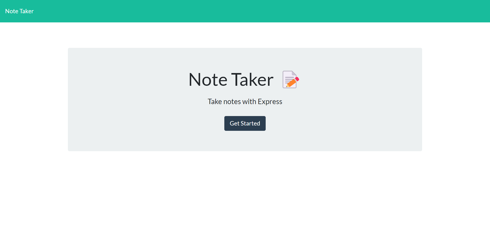
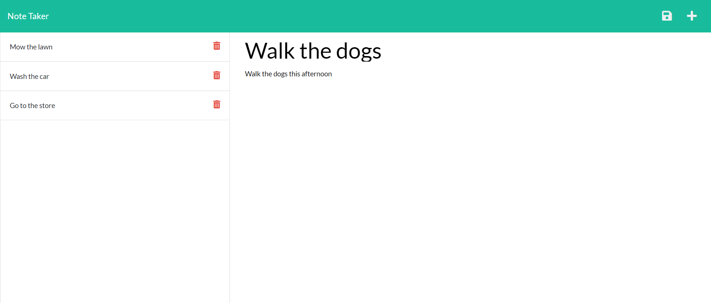

# Note-Taker
## Description
This project is an application that allows users to write, save, and delete notes. The application uses express.js for its back end functionality. The application saves and retrieves note data from a JSON file. This application has been deployed to Heroku.

[View deployed HEROKU app here!](https://note-taker-expressjs-challenge.herokuapp.com/)

## Criteria Met
- When the user opens Note Taker they are presented with a landing page with a link to the notes page
- When the user clicks on the link to the notes page they are presented with a page with existing notes listed in the left-hand column, plus empty fields to enter a new note title and the note’s text in the right-hand column
- When the user enters a new note title and the note's text a save icon appears in the navigation at the top of the page
- When the user clicks the save icon, the new note is saved and appaears in the left-hand column with the other existing notes
- When the user clicks on an existing note in the left-hand column the note will appear in the right-hand column
- When the user clicks on the Write icon in the navigation bar at the top of the page they are presented with empty fields to enter a new note title and the note's text in the right-hand column

## Languages/Frameworks Used
- HTML
- CSS
- Bootstrap 
- JavaScript
- Node.js
  - Express.js
  - Uniqid

## Installation
1. Clone the gitHub repository
2. Open Git Bash or the Terminal
3. Navigate to the directory where you would like to clone the repository to
4. Type the command "git clone" and paste the link to the repository
5. Open your code editor and open the repository
6. Open the terminal window in your code editor
7. Make sure you are in the correct folder in the terminal window
8. Type the command "npm install" in the terminal and press enter to install the dependency packages that are required.

Ensure the following packages were installed correctly
* Express
* Uniqid

## Application Usage
1. In the terminal run the command "node server.js"
2. This will run the server where you can find the page
3. Navigate to http://localhost:3001/ and you should see the application
4. To end the server type the command "Ctrl c"

## Screenshots

### Starter Code
Starter code was provided from https://github.com/coding-boot-camp/miniature-eureka
